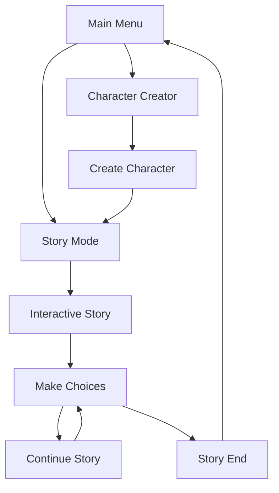

# 🎮 Milindor - Godot Book Game Edition

[](https://godotengine.org/)
[](https://opensource.org/licenses/MIT)
[]()

**Prototipo interattivo** del libro-game ambientato nel mondo fantasy di Milindor, sviluppato in Godot Engine.

## 🎯 Obiettivi del Prototipo

### ✨ Features Implementate
- ✅ **Character Creator**: Creazione personaggi con razze e classi
- ✅ **Story System**: Storie interattive con scelte multiple
- ✅ **Game Manager**: Gestione stato globale e salvataggi
- ✅ **Navigation**: Sistema di navigazione tra scene

### 🎮 Features Pianificate
- [ ] **Save/Load System**: Salvataggio persistente progressi
- [ ] **Audio System**: Musiche di sottofondo e effetti sonori
- [ ] **Visual Effects**: Transizioni animate tra scene
- [ ] **Inventory System**: Gestione oggetti e equipaggiamento
- [ ] **Combat System**: Sistema di combattimento semplificato
- [ ] **Map System**: Mappa interattiva del mondo di Milindor

## 🏗️ Struttura Progetto

```
Milindor-Godot/
├── project.godot          # Configurazione progetto Godot
├── scenes/                # Scene principali (.tscn)
│   ├── Main.tscn         # Menu principale
│   ├── CharacterCreator.tscn  # Creazione personaggi
│   └── StoryScreen.tscn  # Schermata storie
├── scripts/              # Script GDScript
│   ├── MainMenu.gd       # Logica menu principale
│   ├── CharacterCreator.gd  # Logica creazione personaggi
│   ├── StoryScreen.gd    # Logica storie interattive
│   └── GameManager.gd    # Singleton gestione stato
├── data/                 # Dati di gioco (JSON)
│   ├── races.json        # Razze fantasy
│   ├── classes.json      # Classi personaggio
│   └── stories.json      # Storie e dialoghi
└── assets/               # Risorse grafiche e audio
    ├── images/           # Immagini e sprite
    ├── audio/            # Musiche e SFX
    └── fonts/            # Font personalizzati
```

## 🚀 Come Avviare

### Prerequisiti
- [Godot Engine 4.3+](https://godotengine.org/download)
- Conoscenza base di GDScript (opzionale)

### Setup
1. **Clone il repository**:
   ```bash
   git clone https://github.com/[USERNAME]/Milindor-Godot.git
   cd Milindor-Godot
   ```

2. **Apri in Godot**:
   - Lancia Godot Engine
   - Click "Import" → Seleziona `project.godot`
   - Click "Import & Edit"

3. **Esegui il gioco**:
   - Premi F5 o click sul pulsante "Play"
   - Seleziona la scena `Main.tscn` come scena principale

## 🎮 Gameplay Flow



### 🎭 Character Creation
1. **Scegli Razza**: Umano, Elfo, Nano, Halfling, Dragonide
2. **Scegli Classe**: Guerriero, Mago, Ladro, Chierico, Ranger
3. **Inserisci Nome**: Nome del tuo eroe
4. **Conferma**: Crea il personaggio e inizia l'avventura

### 📖 Story Mode
- **Lettura Narrativa**: Testi immersivi ambientati a Milindor
- **Scelte Multiple**: Ogni decisione influenza la storia
- **Conseguenze**: Le tue scelte determinano il destino
- **Progressione**: Sblocca nuovi percorsi narrativi

## 🛠️ Sviluppo

### Architettura
- **MVC Pattern**: Separazione logica/UI/dati
- **Singleton Manager**: GameManager per stato globale
- **Scene System**: Navigazione modulare tra schermate
- **Data-Driven**: Storie e personaggi definiti in JSON

### Estendere il Gioco
1. **Nuove Razze**: Aggiungi entries in `data/races.json`
2. **Nuove Classi**: Modifica `data/classes.json`
3. **Nuove Storie**: Espandi `data/stories.json`
4. **Nuove Scene**: Crea .tscn e collega con script

## 🎨 Art Style

- **Fantasy Medieval**: Atmosfera medievale/fantasy
- **Color Palette**: Toni caldi e terre
- **UI Style**: Pergamene e elementi gotici
- **Typography**: Font medievali per immersione

## 🔄 Migrazione da Flutter

Questo prototipo mantiene la **compatibilità dati** con la versione Flutter:

- ✅ **Stesse razze e classi**: Coerenza tra versioni
- ✅ **Formato JSON**: Riutilizzo dati esistenti
- ✅ **Sistema salvataggio**: Compatibile con Flutter
- ✅ **Game Logic**: Medesime regole di gioco

## 🚀 Export Targets

- 🖥️ **Windows**: EXE per PC e Steam
- 📱 **Android**: APK per tablet
- 🌐 **HTML5**: WebGL per browser
- 🍎 **macOS**: Build nativi Apple

## 🤝 Contributing

Contributi benvenuti! Vedi [CONTRIBUTING.md](../Milindor/CONTRIBUTING.md) per le linee guida.

### Aree di Contributo
- 🎨 **Art & Graphics**: Sprite, UI, backgrounds
- 🎵 **Audio**: Musiche, effetti sonori, voci
- 📝 **Writing**: Storie, dialoghi, lore di Milindor
- 💻 **Programming**: Nuove features, ottimizzazioni
- 🧪 **Testing**: QA, debugging, feedback

## 📄 Licenza

MIT License - Vedi [LICENSE](../Milindor/LICENSE) per dettagli.

---

**Forgia il tuo destino in Milindor! ⚔️✨**
