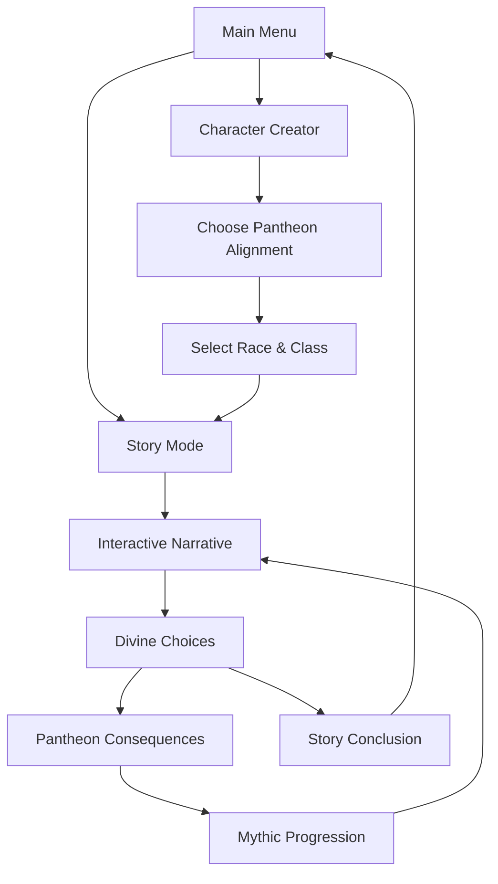

# 🎮 Milindor - Divine Conflicts

[](https://godotengine.org/)
[](https://opensource.org/licenses/MIT)
[]()
[]()

**Interactive fantasy RPG** set in the original world of Milindor, featuring divine conflicts across seven continents. Built entirely with AI assistance and Godot Engine.

> 🤖 **AI-Powered Development**: This project is created entirely with AI assistance, featuring original cosmology, narrative systems, and gameplay mechanics inspired by the political complexity of EU4's Anbennar mod.

## 🌍 World of Milindor

### 🏛️ Divine Cosmology
Milindor is a world shaped by the eternal conflicts between **Six Divine Pantheons**, each vying for cosmic dominance. The world spans **Seven Continents**, each influenced by different divine powers and their endless wars.

#### The Six Pantheons
- **🔥 Pyronis Dominion**: Fire, War, and Conquest
- **🌊 Thalassic Assembly**: Seas, Trade, and Exploration  
- **🌱 Verdant Covenant**: Nature, Growth, and Harmony
- **⚡ Astral Sovereignty**: Order, Magic, and Knowledge
- **🌑 Umbral Syndicate**: Shadows, Secrets, and Change
- **⚔️ Ferrous Compact**: Metal, Craft, and Civilization

### 🗺️ Seven Continents
The world's geography reflects divine influence, with each continent bearing the mark of different pantheon conflicts and alliances.

### 🎲 Unique Magic System
Magic in Milindor flows from **Divine Resonance** - the magical energy generated by conflicts between the pantheons. The more intense the divine strife, the more powerful the magical forces that mortals can harness.

## 🎯 Game Features

### ✨ Core Systems
- ✅ **Character Creator**: Create heroes aligned with divine pantheons
- ✅ **Narrative Engine**: Interactive stories with meaningful choices
- ✅ **Divine Progression**: Mythic paths tied to pantheon allegiances
- ✅ **Cosmological Lore**: Rich world-building with six pantheon conflicts
- ✅ **Dual Language**: Full localization in English and Italian

### 🎮 Planned Features
- [ ] **Divine Resonance Magic**: Magic system based on pantheon conflicts
- [ ] **Continental Exploration**: Journey across seven distinct continents
- [ ] **Pantheon Politics**: Complex relationships between divine factions
- [ ] **Mythic Ascension**: Character progression beyond mortal limits
- [ ] **Interactive Timeline**: World events shaped by divine wars
- [ ] **Cultural Diversity**: Societies influenced by different pantheons

## 🏗️ Project Structure

```
Milindor/
├── project.godot          # Godot project configuration
├── scenes/                # Game scenes (.tscn)
│   ├── Main.tscn         # Main menu
│   ├── CharacterCreator.tscn  # Character creation
│   └── StoryScreen.tscn  # Interactive narratives
├── scripts/              # GDScript logic
│   ├── MainMenu.gd       # Main menu controller
│   ├── CharacterCreator.gd  # Character creation logic
│   ├── StoryScreen.gd    # Story progression system
│   └── GameManager.gd    # Global state management
├── data/                 # Game data (JSON)
│   ├── races.json        # Playable races
│   ├── classes.json      # Character classes
│   ├── milindor_cosmology.json  # Divine pantheons & lore
│   └── advanced_progression.json  # Mythic progression paths
└── assets/               # Game resources
    ├── images/           # Sprites and UI graphics
    ├── audio/            # Music and sound effects
    └── fonts/            # Typography assets
```

## 🚀 Getting Started

### Prerequisites
- [Godot Engine 4.3+](https://godotengine.org/download)
- Basic understanding of GDScript (optional)

### Setup
1. **Clone the repository**:
   ```bash
   git clone https://github.com/[USERNAME]/Milindor.git
   cd Milindor
   ```

2. **Open in Godot**:
   - Launch Godot Engine
   - Click "Import" → Select `project.godot`
   - Click "Import & Edit"

3. **Run the game**:
   - Press F5 or click the "Play" button
   - Select `Main.tscn` as the main scene

## 🎮 Gameplay Experience



### 🎭 Character Creation
1. **Choose Pantheon**: Align with one of six divine factions
2. **Select Race**: Fantasy races influenced by divine powers
3. **Pick Class**: Classes with pantheon-specific abilities
4. **Name Your Hero**: Create your champion of the divine
5. **Begin Journey**: Start your mythic adventure

### 📖 Narrative System
- **Divine Conflicts**: Stories shaped by pantheon wars
- **Meaningful Choices**: Decisions that affect divine balance
- **Mythic Progression**: Transcend mortality through divine favor
- **Cultural Immersion**: Experience societies shaped by gods
- **Continental Scope**: Adventures spanning seven continents

## 🛠️ Development

### Architecture
- **AI-Generated Content**: All systems designed with AI assistance
- **Data-Driven Design**: Cosmology and progression defined in JSON
- **Modular Scene System**: Scalable narrative and UI components
- **Singleton Pattern**: Global state management via GameManager
- **Localization Ready**: English and Italian language support

### Expanding the Game
1. **New Pantheons**: Add divine factions in `milindor_cosmology.json`
2. **Continental Lore**: Expand geographical data and cultures
3. **Mythic Paths**: Create progression routes in `advanced_progression.json`
4. **Narrative Branches**: Build complex story trees with divine consequences
5. **Magic Schools**: Implement Divine Resonance magic system

## 🎨 Design Philosophy

### Inspiration Sources
- **EU4 Anbennar Mod**: Political complexity and fantasy nation-building
- **Divine Conflict Mythology**: Original pantheon-based cosmology
- **AI-Driven Creativity**: Leveraging artificial intelligence for content generation

### Visual Style
- **Epic Fantasy**: Majestic divine themes and continental scope
- **Political Intrigue**: Visual representation of complex pantheon relationships
- **Cultural Diversity**: Art reflecting different divine influences
- **Mythic Progression**: Visual evolution from mortal to divine champion

## 🌐 Localization

**Milindor** is fully localized in:
- 🇺🇸 **English** (Primary language)
- 🇮🇹 **Italian** (Complete translation)

All narrative content, UI elements, and lore descriptions are available in both languages, ensuring accessibility for international audiences.

## 🚀 Export Targets

- 🖥️ **Windows**: EXE for PC and Steam distribution
- 📱 **Android**: APK for mobile and tablet devices
- 🌐 **HTML5**: WebGL for browser-based gaming
- 🍎 **macOS**: Native builds for Apple platforms

## 🤝 Contributing

Contributions welcome! This AI-generated project thrives on community input and expansion.

### Areas of Contribution
- 🎨 **Art & Graphics**: Divine pantheon visuals, continental maps
- 🎵 **Audio**: Epic soundtracks, divine ambient themes
- 📝 **Writing**: Expand pantheon lore, continental cultures
- 💻 **Programming**: New systems, AI-assisted feature development
- 🌍 **Localization**: Additional language support beyond EN/IT
- 🧪 **Testing**: QA, balance testing, narrative flow validation

### AI Collaboration
This project demonstrates the potential of AI-assisted game development. Contributors are encouraged to leverage AI tools for:
- Content generation and expansion
- Code optimization and refactoring  
- Narrative branching and world-building
- System design and implementation

## 📄 License

MIT License - See [LICENSE](LICENSE) for details.

---

**⚔️ Forge your destiny among the Divine Conflicts of Milindor! ✨**

*"In a world where gods wage eternal war, mortals must choose their divine allegiance and transcend the boundaries between the mortal and mythic realms across seven continents shaped by divine power."*
